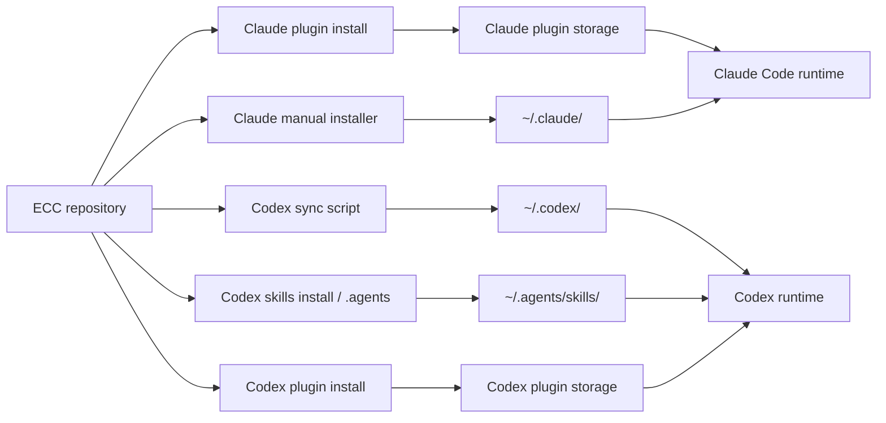
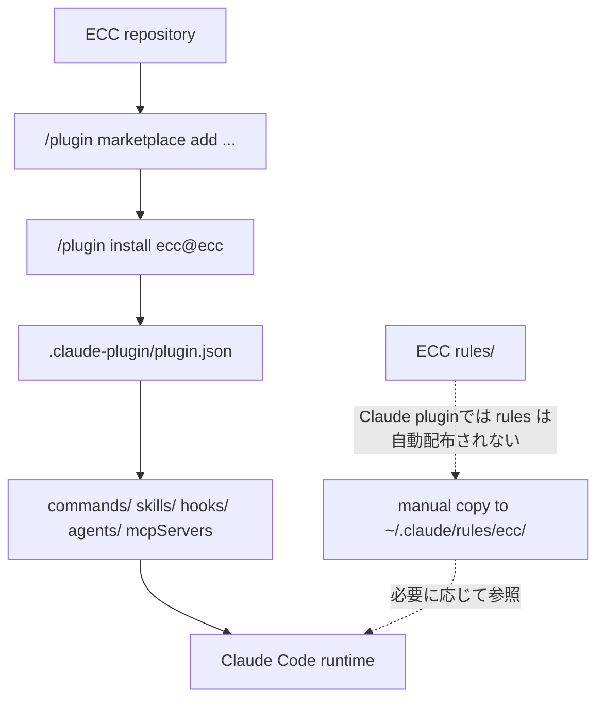
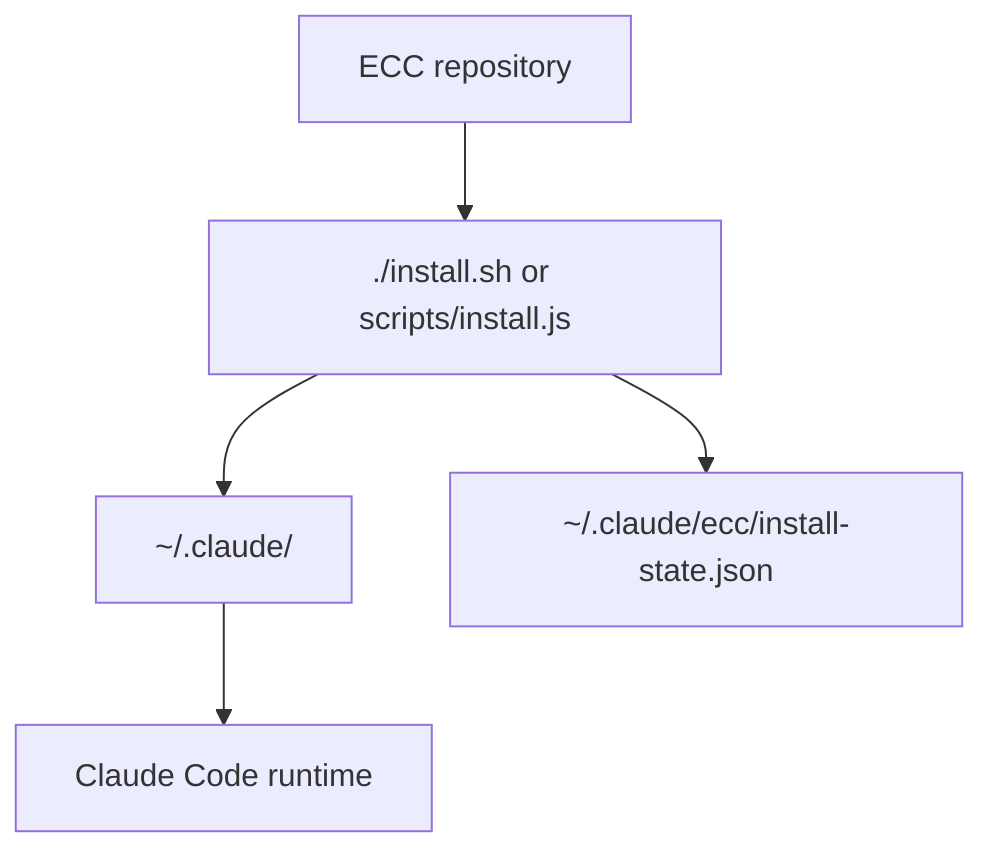
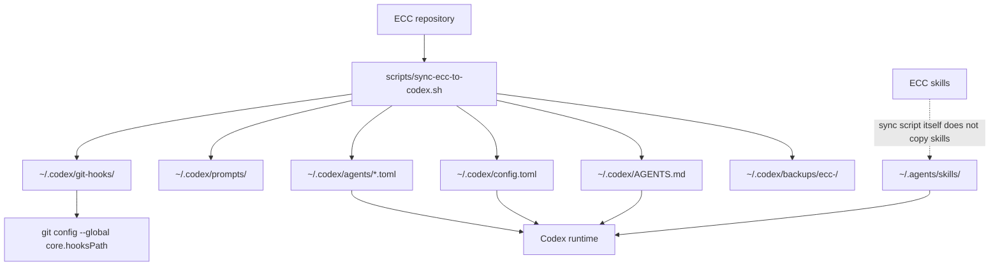
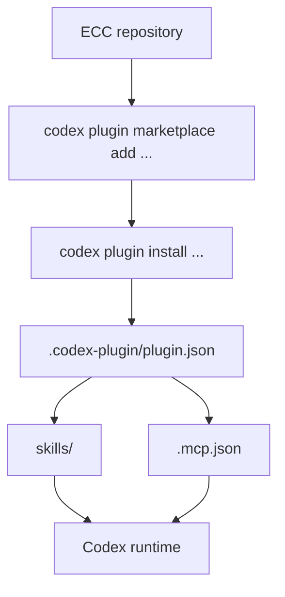
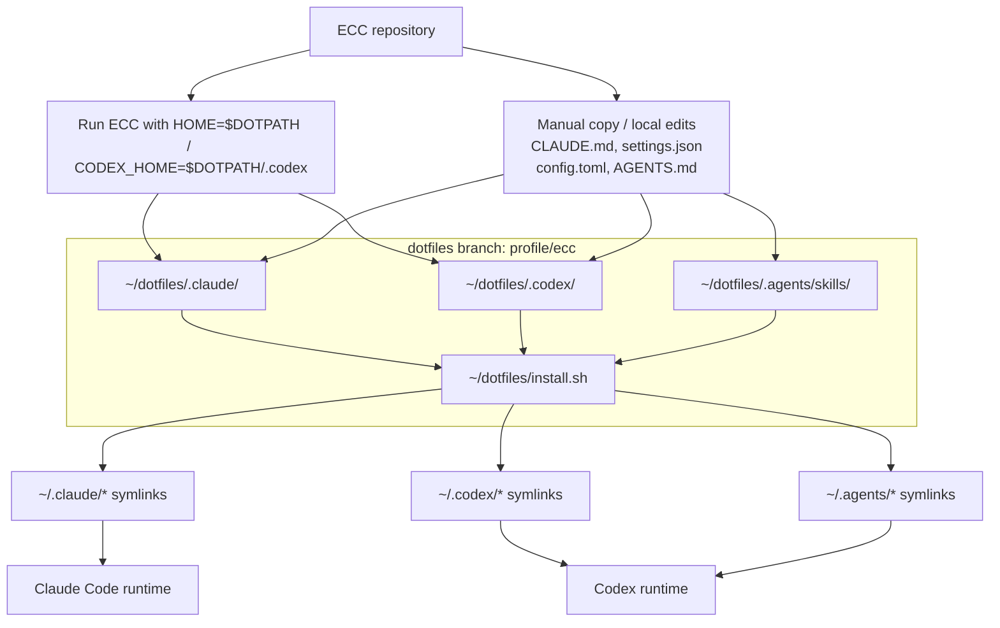

# ECC Application Map for Claude Code and Codex

Last reviewed: 2026-05-27

このメモは、Everything Claude Code (ECC) を Claude Code と Codex に適用するときに、何がどこへ配置され、各エージェントがどこから読むのかを整理するためのものです。

ここでは次の2つを分けて扱います。

- **公式の読み込み仕様**: Claude Code / Codex がランタイムで読む場所
- **ECCの配置方法**: ECC の plugin / installer / sync script がファイルを置く場所

## 全体像



重要なのは、plugin install と manual installer は同じ種類の資産を別経路でランタイムへ渡すことがある点です。ECC README でも、Claude plugin を使う場合は `--profile full` の manual installer を重ねない方針が示されています。

## Claude Code

### 公式の読み込み場所

| 種類 | Claude Code が読む場所 | 読み込み・優先順位の要点 | 公式ドキュメント |
|---|---|---|---|
| Memory / instruction | `~/.claude/CLAUDE.md`, `./CLAUDE.md` | 起動時に読み込まれる。プロジェクトでは current working directory から親方向の `CLAUDE.md` が対象になり、`@path` import も使える。 | [Memory](https://docs.anthropic.com/en/docs/claude-code/memory) |
| Settings | `~/.claude/settings.json`, `.claude/settings.json`, `.claude/settings.local.json`, managed policy | 権限、環境変数、model、hooks、plugin 有効化などを設定する。local project settings は個人用。 | [Settings](https://docs.anthropic.com/en/docs/claude-code/settings) |
| Subagents | `~/.claude/agents/`, `.claude/agents/` | Markdown + YAML frontmatter。project subagent が user subagent より優先される。 | [Sub agents](https://docs.anthropic.com/en/docs/claude-code/sub-agents) |
| Hooks | settings files 内 | `PreToolUse`, `PostToolUse`, `Notification`, `UserPromptSubmit`, `Stop`, `SubagentStop`, `PreCompact`, `SessionStart`, `SessionEnd` などのイベントで shell command を実行する。 | [Hooks](https://docs.anthropic.com/en/docs/claude-code/hooks) |
| Plugins | `/plugin` で追加した marketplace / plugin | plugin manifest が commands, agents, hooks, MCP servers, skills などの同梱コンポーネントを指す。`settings.json` の `enabledPlugins` にも関係する。 | [Plugins](https://docs.anthropic.com/en/docs/claude-code/plugins) |

### Claude plugin route



ECC の Claude plugin は、Claude Code の plugin 機構に乗せて commands / skills / hooks / agents / MCP server などを配布する経路です。

ECC README では、plugin install の場合は plugin が ECC の skills / commands / hooks を読み込むため、`--profile full` の manual installer は重ねない方針が説明されています。一方で、Claude plugin は rules を自動配布できないため、必要な rule pack は `~/.claude/rules/ecc/` へ手動コピーする運用が示されています。

### Claude manual installer route



ECC の installer target for Claude home は、ECC 資産を `~/.claude/` 配下へ配置します。`hooks-runtime` を含める場合、ECC hooks は `~/.claude/settings.json` ではなく `~/.claude/hooks/hooks.json` に resolved hook graph として配置されます。ECC の install state は `~/.claude/ecc/install-state.json` に記録され、uninstall 時はこの記録を基準に削除対象を判断します。

この経路は Claude Code 公式の通常読み込み場所にファイルを置く方式です。plugin route と重ねると、同種の skills / commands / hooks が重複する可能性があります。

## Codex

### 公式の読み込み場所

| 種類 | Codex が読む場所 | 読み込み・優先順位の要点 | 公式ドキュメント |
|---|---|---|---|
| Instructions | `~/.codex/AGENTS.override.md` または `~/.codex/AGENTS.md`, project root から cwd までの `AGENTS.override.md` / `AGENTS.md` | 起動時に instruction chain を構築する。global では override があればそれを読み、project では root から cwd へ順に重ねる。近い階層の指示が後に来る。 | [AGENTS.md](https://developers.openai.com/codex/guides/agents-md#how-codex-discovers-guidance) |
| Config | `~/.codex/config.toml`, trusted project の `.codex/config.toml` | user config が基本。trusted project では project config も読む。ただし provider / auth / telemetry など machine-local な設定は project config からは上書きできない。 | [Config reference](https://developers.openai.com/codex/config-reference#configtoml) |
| Skills | `$CWD/.agents/skills`, 親方向の `.agents/skills`, `$REPO_ROOT/.agents/skills`, `$HOME/.agents/skills`, `/etc/codex/skills`, system bundled skills | repo, user, admin, system の各場所から読む。symlink された skill directory もサポートされる。同名 skill は merge されない。 | [Skills](https://developers.openai.com/codex/skills#where-to-save-skills) |
| Custom agents | `~/.codex/agents/*.toml`, `.codex/agents/*.toml` | personal agent と project-scoped agent を TOML で定義する。spawn された subagent session の config layer として使われる。 | [Subagents](https://developers.openai.com/codex/subagents#custom-agents) |
| Hooks | `~/.codex/hooks.json`, `~/.codex/config.toml`, trusted project の `.codex/hooks.json`, `.codex/config.toml`, plugin bundled hooks | active config layers の横にある hooks を読む。複数 source の hooks は置換ではなく追加で読み込まれる。project local hooks は project が trusted の場合のみ。 | [Hooks](https://developers.openai.com/codex/hooks#where-codex-looks-for-hooks) |
| Plugins | plugin manifest が指す bundled components | Codex plugin manifest は skills, MCP servers, apps, hooks などを plugin root からの相対パスで指せる。marketplace は CLI から追加できる。 | [Plugin manifest](https://developers.openai.com/codex/plugins/build#manifest-fields), [Marketplace](https://developers.openai.com/codex/plugins/build#add-a-marketplace-from-the-cli) |

### Codex sync script route



ECC の `scripts/sync-ecc-to-codex.sh` は、Codex を使う前提で `~/.codex/` に ECC の instruction / config / agents / prompts / MCP 設定などを同期する補助スクリプトです。

このスクリプトは既存の `~/.codex/config.toml` と `AGENTS.md` をバックアップします。`config.toml` には ECC baseline / MCP settings を add-only で追記し、`AGENTS.md` には marker 付き ECC block を追加・更新します。skills についてはスクリプト内で直接コピーせず、Codex 公式の読み込み場所である `~/.agents/skills/` などから読む前提になっています。

注意点として、この route は Claude manual installer のような install state ベースの uninstall とは性質が違います。バックアップや marker はありますが、dotfiles で管理している `~/.codex/config.toml` や `AGENTS.md` が symlink の場合、sync script はリンク先の dotfiles 側を書き換えます。

### Codex plugin route



ECC には Codex plugin manifest もあります。Codex plugin route では、plugin manifest が `skills/` や `.mcp.json` などの bundled components を指し、Codex が plugin として読み込みます。

Codex 公式ドキュメントでは、plugins は skills / MCP servers / apps / hooks などを manifest から配布できる仕組みとして説明されています。plugin route を使う場合、同じ資産を `~/.codex/` や `~/.agents/skills/` に手動展開するかどうかは、重複を避ける観点で分けて考える必要があります。

## dotfiles で管理するときの考え方



この dotfiles では、ECC を使う user-level agent profile を `profile/ecc` branch として扱います。ECC を本物の `~/.claude/` / `~/.codex/` に直接展開するのではなく、まず dotfiles 側に受けてから、dotfiles の `install.sh` が実 HOME に symlink します。

### profile/ecc branch の運用方針

Claude 側は、ECC manual installer を `HOME=$DOTPATH` で実行し、`~/dotfiles/.claude/` に ECC の配置物を受けます。

```bash
export DOTPATH="$HOME/dotfiles"
export ECC_REPO="/path/to/everything-claude-code"

cd "$ECC_REPO"

# 依存関係は通常 HOME で先に解決する。HOME=$DOTPATH 中に npm cache 等を dotfiles へ混ぜないため。
npm install

# まず配置先だけ確認する。
HOME="$DOTPATH" bash ./install.sh --target claude --profile full --dry-run

# 問題なければ dotfiles 側へ適用する。
HOME="$DOTPATH" bash ./install.sh --target claude --profile full
```

このとき Claude 側の出力先は、概ね次のようになります。

```text
~/dotfiles/.claude/rules/ecc/
~/dotfiles/.claude/skills/ecc/
~/dotfiles/.claude/commands/
~/dotfiles/.claude/agents/
~/dotfiles/.claude/hooks/
~/dotfiles/.claude/scripts/
~/dotfiles/.claude/mcp-configs/
~/dotfiles/.claude/the-security-guide.md
~/dotfiles/.claude/ecc/install-state.json
```

その後、dotfiles の `install.sh` が `~/dotfiles/.claude/*` を `~/.claude/*` に個別 symlink します。これにより、Claude Code からは公式の user-level 読み込み場所にあるように見えますが、実体は dotfiles branch 側に残ります。

Codex 側は、ECC sync script が `HOME` ではなく `CODEX_HOME` を主な出力先として使います。dotfiles 側に受ける場合は、`CODEX_HOME="$DOTPATH/.codex"` を明示します。`HOME` は user-level path の基準、`AGENTS_HOME` は user-level skills の向き先、`GIT_CONFIG_GLOBAL` は global git hooks 設定の書き込み先に関係するため、dry-run でも明示しておきます。

```bash
export DOTPATH="$HOME/dotfiles"
export ECC_REPO="/path/to/everything-claude-code"

cd "$ECC_REPO"

# まず配置先だけ確認する。
HOME="$DOTPATH" \
CODEX_HOME="$DOTPATH/.codex" \
AGENTS_HOME="$DOTPATH/.agents" \
ECC_GLOBAL_HOOKS_DIR="$DOTPATH/.codex/git-hooks" \
GIT_CONFIG_GLOBAL="$DOTPATH/.gitconfig.local" \
bash scripts/sync-ecc-to-codex.sh --dry-run
```

Codex sync は `~/.codex/prompts/ecc-*` や `~/.codex/agents/*.toml` のように、`ecc/` directory ではなく既存 directory 直下へ配置します。また global git safety hooks の設定も含むため、apply は別途方針を確認してから行います。

Codex sync script は skills をコピーしません。Codex が user-level skills として読む `$HOME/.agents/skills/` は、ECC repo の `.agents/skills/` 全体を `~/dotfiles/.agents/skills/` に取り込み、dotfiles の `install.sh` で実 HOME へ symlink します。ECC の Codex sanity check が確認する 16 skills は、この bundle の代表的な確認対象であり、skills の profile / subset 選択ではありません。

`install.sh` は `.claude`, `.codex`, `.agents` を directory 丸ごとではなく中身単位で symlink します。dot entry も対象にするため、`.claude/.agents` のような hidden entry も実 HOME へ反映できます。一方で、`~/.claude/projects`, `~/.codex/auth.json`, sessions, logs, backups, git hooks, install-state などの runtime state は skip list で除外します。既存の non-managed directory / file と衝突した場合は、symlink 作成前の preflight で止めます。

### 管理対象と ignore 方針

原則として、agent profile の desired state として再現・差分確認したいものは dotfiles の tracked file として持ちます。branch はその desired state を切り替える単位として扱い、環境依存の runtime state は commit しません。

commit 対象の考え方:

- ECC installer / sync から取り込んだ asset のうち、`profile/ecc` の runtime surface として再現・差分確認したいものを commit する。
- Claude 側は `.claude/ecc/install-state.json` を除き、manual installer が配置した instruction / config / agent asset を対象にする。`--profile full` で増える `the-security-guide.md` のような top-level asset も、この定義に含める。
- Codex 側は sync script が配置した `AGENTS.md`, `config.toml`, `agents`, `prompts` などのうち、Codex runtime から読む desired state を対象にする。
- Codex skills は ECC repo の `.agents/skills/` bundle 全体を desired state として対象にする。
- `.claude/CLAUDE.md`, `.claude/settings.json`, `.codex/config.toml` など、installer 外で手動管理する user-level file も、この profile の desired state として必要なら commit する。
- `install.sh` や `docs/` は ECC asset ではなく、この方針を説明・実現する dotfiles local policy として別途 commit する。

ignore 対象:

- `.claude/ecc/install-state.json`
- `.codex/ecc-install-state.json` if using ECC codex-home installer
- `.codex/backups/`
- `.codex/git-hooks/`
- `.gitconfig.local`
- credentials, auth files, session logs, cache, history database, plugin cache, `.agents` runtime/cache state

ignore 対象は `.gitignore` でも enforce します。ignore 対象のファイルは branch を切り替えても作業ツリーに残ります。commit 対象は、`profile/ecc` の desired state として再現・差分確認したいものに限定します。ignore 対象は環境ごとの runtime state に限定します。

特に注意したいのは次の点です。

- `~/.codex/config.toml` や `~/.codex/AGENTS.md` が dotfiles への symlink の場合、ECC の sync script は dotfiles 側を直接変更する。
- `core.hooksPath` は tracked `.gitconfig` ではなく machine-local な `.gitconfig.local` に書く。dotfiles 側の sync apply では `$DOTPATH/.gitconfig.local` に逃がし、実 HOME で global hooks を有効化する場合は `$HOME/.gitconfig.local` に書く。
- `.codex/git-hooks/` は commit しないため、別環境では `scripts/codex/install-global-git-hooks.sh` で hook body と hooksPath を再生成する。
- Codex sync は existing agent role file を保持し、古い `ecc-*.md` prompt を自動削除しないため、upstream 更新時は manifest / prefix ベースで cleanup してから再 sync する。
- dotfiles branch を切り替える場合、tracked な ECC asset は branch checkout で切り替え、実 HOME 側の symlink は `install.sh` で更新する。ECC repo 側の uninstall / doctor / repair は、`profile/ecc` branch 上で `HOME=$DOTPATH` に取り込んだ ECC generated asset を撤去・検査・再生成するときに `HOME="$DOTPATH"` 付きで使う。`.claude/ecc/install-state.json` は lifecycle command が削除・検査対象を判断するための記録なので、単体では消さない。
- `.claude/ecc/install-state.json` は ignored lifecycle state であり、desired state として commit しない。clean clone や `git clean -X` 後に ECC lifecycle command を使う場合は、`HOME=$DOTPATH` install で state を再生成してから実行する。
- Claude plugin route と Claude manual installer route は重ねない。特に plugin install 後に `--profile full` を重ねない。
- Codex plugin route と `~/.agents/skills/` への手動展開は、同じ skill が重複して見える可能性がある。
- credentials, auth files, session logs, cache, history database, plugin cache は dotfiles に入れない。
- project ごとの `AGENTS.md`, `CLAUDE.md`, `.codex/config.toml`, `.claude/settings.json` は、user-level 設定と別レイヤーとして扱う。

## ECC local references

The examples in this document use `ECC_REPO=/path/to/everything-claude-code`.

- ECC README: `$ECC_REPO/README.md`
- Claude installer target: `$ECC_REPO/scripts/lib/install-targets/claude-home.js`
- Codex installer target: `$ECC_REPO/scripts/lib/install-targets/codex-home.js`
- Codex sync script: `$ECC_REPO/scripts/sync-ecc-to-codex.sh`
- Claude plugin manifest: `$ECC_REPO/.claude-plugin/plugin.json`
- Codex plugin manifest: `$ECC_REPO/.codex-plugin/plugin.json`

## Official references

- Anthropic Claude Code settings: <https://docs.anthropic.com/en/docs/claude-code/settings>
- Anthropic Claude Code memory: <https://docs.anthropic.com/en/docs/claude-code/memory>
- Anthropic Claude Code subagents: <https://docs.anthropic.com/en/docs/claude-code/sub-agents>
- Anthropic Claude Code hooks: <https://docs.anthropic.com/en/docs/claude-code/hooks>
- Anthropic Claude Code plugins: <https://docs.anthropic.com/en/docs/claude-code/plugins>
- OpenAI Codex AGENTS.md: <https://developers.openai.com/codex/guides/agents-md#how-codex-discovers-guidance>
- OpenAI Codex config: <https://developers.openai.com/codex/config-reference#configtoml>
- OpenAI Codex skills: <https://developers.openai.com/codex/skills#where-to-save-skills>
- OpenAI Codex hooks: <https://developers.openai.com/codex/hooks#where-codex-looks-for-hooks>
- OpenAI Codex subagents: <https://developers.openai.com/codex/subagents#custom-agents>
- OpenAI Codex plugin manifest: <https://developers.openai.com/codex/plugins/build#manifest-fields>
- OpenAI Codex plugin marketplace: <https://developers.openai.com/codex/plugins/build#add-a-marketplace-from-the-cli>
