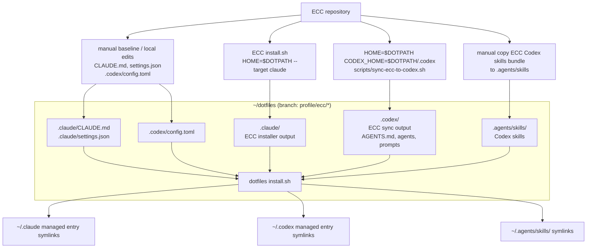

# ECC Dotfiles Manual Install Procedure

- Last reviewed: 2026-05-30
- ECC version: 2.0.0-rc.1

この手順書では、dotfiles の `profile/ecc-base` branch から環境ごとの `profile/ecc/*` branch を切り、自環境に対して Everything Claude Code (ECC) の manual install を実施する方法を説明します。

**＜新しい環境で最初にやること＞**

`profile/ecc-base` を pull しただけでは、その環境で ECC を利用する準備は完了しません。`profile/ecc-base` は管理体制と一部の baseline となる profile のみを持つ branch であり、ECC install の outputs 自体は持っていません。

新しい環境では、`profile/ecc-base` から `profile/ecc/full` などの環境用 branch を切り、`HOME=$DOTPATH` を指定したうえで ECC の manual install を実行することで、dotfiles 側に ECC install outputs を取得します。その後、`install.sh` によって実 HOME 側に outputs の symlink を作成することで、自環境に対して ECC profile を適用します。

## 前提

- dotfiles の base branch は `profile/ecc-base` を使う。ECC install outputs は `profile/ecc-base` から切った `profile/ecc/*` branch に取り込む。
- Claude 側は ECC の plugin route ではなく manual installer route を使って profile をインストールする。plugin route を重ねて使用しないようにする。
- Codex 側は ECC の plugin route ではなく sync script route を使って profile をインストールする。plugin route を重ねて使用しないようにする。
- 最初に dry-run で配置先を確認してからインストールを実施する。

この手順書のコマンド例は、最初に以下の変数を定義した上で使用します。`DOTPATH` には、自分の dotfiles の場所を指定します。`ECC_REPO` には、自分の環境における ECC リポジトリの clone 先を指定します。

```bash
export DOTPATH="$HOME/dotfiles"
export ECC_REPO="/path/to/everything-claude-code"
```

## Branch model

この dotfiles では、ECC の管理体制と install output の置き場所を分離します。

- `profile/ecc-base`: `install.sh`, `.gitignore`, ECC example ベースの `.claude/CLAUDE.md`, `.claude/settings.json`, 最小の `.codex/config.toml`, そして scripts, docs などを置く base branch。ECC installer / sync が生成する大量の asset は置かない。
- `profile/ecc/*`: `profile/ecc-base` から切る環境用 branch。ここで Claude install、Codex sync、Codex skills bundle 取り込みを実行し、生成された desired surface を `install.sh` で環境の HOME に適用する。

`profile/ecc/*` branch は、別環境でそのまま checkout して使うことをサポート対象にしません。特に Codex generated prompts には `ECC_REPO` や `DOTPATH` の絶対パスが入るため、別環境では `profile/ecc-base` から新しい branch を切って sync / install をやり直します。既存の環境用 branch は別環境での適用対象ではなく、install 結果やその後の拡張を参照するための記録として扱います。

```bash
# branch の作成例
cd "$DOTPATH"
git checkout profile/ecc-base
git checkout -b profile/ecc/full # --profile full で Claude manual installer を実行する例
```

branch 名は運用上の目印です。`profile/ecc/full/<env>` のようにPC名などの環境名を含めても問題ありません。`install.sh` は `profile/ecc-base` では install output 用の local state check を行わず、`profile/ecc/*` で実行するときに local state check を行います。

## 全体像



`~/dotfiles (branch: profile/ecc/*)` は profile/ecc-base から引き継いだ baseline に加えて、ECC installer / sync の outputs と、installer 外で手動管理をする他の user-level file を受ける profile 境界です。`CLAUDE.md` と `settings.json`、`.codex/config.toml` は `profile/ecc-base` に baseline として配置されたものを引き継ぎ、profile branch を切ったあとで必要に応じてその branch 上で上書き・調整します。

## Manual install の範囲

ECC の Claude manual installer は、profile に含まれる modules を `~/.claude/` に配置します。この手順では `HOME=$DOTPATH` を指定するため、実際の出力先は `~/dotfiles/.claude/` になります。

代表的な module と配置先は次です。

| module | 主な source | `HOME=$DOTPATH` での配置先 |
|---|---|---|
| `rules-core` | `rules/` | `~/dotfiles/.claude/rules/ecc/` |
| `agents-core` | `.agents/`, `agents/`, `AGENTS.md` | `~/dotfiles/.claude/.agents/`, `~/dotfiles/.claude/agents/`, `~/dotfiles/.claude/AGENTS.md` |
| `commands-core` | `commands/` | `~/dotfiles/.claude/commands/` |
| `hooks-runtime` | `hooks/`, `scripts/hooks/`, `scripts/lib/` | `~/dotfiles/.claude/hooks/`, `~/dotfiles/.claude/scripts/` |
| `platform-configs` | `.claude-plugin/`, `mcp-configs/`, setup scripts | `~/dotfiles/.claude/plugin.json`, `~/dotfiles/.claude/mcp-configs/`, `~/dotfiles/.claude/scripts/` |
| `workflow-quality` | workflow skills | `~/dotfiles/.claude/skills/ecc/` |
| `framework-language` | language/framework skills | `~/dotfiles/.claude/skills/ecc/` |
| `database` | database skills | `~/dotfiles/.claude/skills/ecc/` |
| `orchestration` | orchestration commands/scripts/skills | `~/dotfiles/.claude/commands/`, `~/dotfiles/.claude/scripts/`, `~/dotfiles/.claude/skills/ecc/` |

ECC installer の install-state は `~/dotfiles/.claude/ecc/install-state.json` に作られます。これは環境依存の実行結果なので、原則 commit しません。

### Profile choices

この手順書で確認した profile は以下です。operation数はこの環境で dry-run した目安です。

| profile | operations | 用途 |
|---|---:|---|
| `minimal` | 359 | rules / agents / commands / platform / workflow。hooksなしで軽めに試す。 |
| `core` | 474 | `minimal` + hooks runtime。ECCの基本挙動を一通り見る。 |
| `developer` | 577 | 通常開発向けの軽め候補。`core` + language/framework + database + orchestration。 |
| `security` | 490 | security-heavy profile。 |
| `research` | 499 | research / content / social workflows。 |
| `full` | 733 | 全classified modules。この branch の既定。 |

この手順書では `full` profile を指定したコマンド例を記載します。`developer` は、daily development の surface を軽くしたい場合に選択できます。

### Installer 外で手動管理するもの

以下は Claude manual installer の主要対象ではなく、dotfiles profile として別途扱う優先度が高い user-level file / directory です。

- `.claude/CLAUDE.md`: Claude Code の user memory。ECC examples を参考にしつつ、`profile/ecc-base` の手動 baseline として管理する。profile branch を切ったあとで、その branch 用に上書き・調整してもよい。
- `.claude/settings.json`: permissions, model, env, statusLine などの user settings。ECC hooks は manual installer が `.claude/hooks/hooks.json` に生成するため、ここには手動追加せず、`profile/ecc-base` の個人 baseline として維持しつつ調整する。
- `.codex/config.toml`: Codex の user config。ECC sync の入力として存在が必要。sync 後は ECC baseline / MCP settings が add-only で追記されるが、`AGENTS.md` のような marker block は入らない。
- `.codex/AGENTS.md`: Codex の global instructions。`profile/ecc-base` に必須ではなく、環境用 profile branch で ECC sync により marker付き block を生成・更新する。
- `.agents/skills/`: Codex が読む user-level skills。ECC sync script は skills をコピーしないため、環境用 profile branch で ECC repo から bundle 全体を取り込む。
- `install.sh`: dotfiles から実 HOME へ symlink する責務を持つ。
- `docs/`: 今回の運用方針、`HOME=$DOTPATH` 手順、runtime state / branch 切り替え方針を記録する。

project-level の `AGENTS.md`, `CLAUDE.md`, `.codex/config.toml`, `.claude/settings.json` は別レイヤーとして後から各projectで管理します。

以下のコマンドは、`profile/ecc-base` の手動 baseline を作る、または upstream example を見直すときの参考です。環境用の `profile/ecc/*` branch で毎回実行する install 手順ではありません。既存ファイルを置き換えるため、実行前に `git diff` で差分を確認します。

```bash
cd "$DOTPATH"
mkdir -p .claude .codex

# Claude user memory example. ECC installer は ~/.claude/CLAUDE.md を作らないため、必要なら example を元に管理する。
cp "$ECC_REPO/examples/user-CLAUDE.md" .claude/CLAUDE.md

# Codex user config baseline. ECC sync は config.toml が存在しないと止まるため、空ではなくECC baselineから始めたい場合に使う。
cp "$ECC_REPO/.codex/config.toml" .codex/config.toml

# Codex global instructionsをsyncなしで下書きしたい場合。
# sync scriptを使う場合は、このファイルは作らなくてもよい。syncがmarker付きで生成/更新する。
{
  printf '<!-- BEGIN ECC -->\n'
  cat "$ECC_REPO/AGENTS.md"
  printf '\n\n---\n\n# Codex Supplement (From ECC .codex/AGENTS.md)\n\n'
  cat "$ECC_REPO/.codex/AGENTS.md"
  printf '\n<!-- END ECC -->\n'
} > .codex/AGENTS.md
```

上の `.codex/AGENTS.md` 生成は、ECC sync script の `compose_ecc_block` と同じ考え方です。既存の personal instructions を残したい場合は、`<!-- BEGIN ECC -->` block の外側に追記します。

メモ：`CLAUDE.md` は example の `user-CLAUDE.md` の状態だと体裁や一部パスの記述に不整合があったため、cpコマンドの実施後に `profile/ecc-base` 上で中身の調整を実施しています（ECC ver: 2.0.0-rc.1 時点）

### Claude settings と ECC hooks の分担

Claude Code の user 設定には、permissions / model / env / statusLine のような個人設定と、tool 実行前後に動く hooks があります。この手順では、この2つを同じ `settings.json` に混ぜず、個人設定は `.claude/settings.json`、ECC が用意する hooks は installer output に分けて管理します。

`.claude/settings.json` は ECC manual installer が生成・更新する対象ではありません。manual installer で `hooks-runtime` を入れる場合、ECC hooks は `~/dotfiles/.claude/hooks/hooks.json` に resolved hook graph として書かれます。raw repo の `hooks/hooks.json` は plugin / repo 向けの元データなので、`settings.json` に貼らず、直接 `~/dotfiles/.claude/hooks/hooks.json` にコピーもしません。

Claude Code の user setting として、ECC repo からは `statusLine` が使用できます。使う場合には `examples/statusline.json` の `statusLine` object を `.claude/settings.json` に手動で merge します。

manual install 後は Claude Code の `/hooks` で ECC hooks が見えているか確認します。Claude 公式ドキュメントでは user/project hooks は settings files、plugin hooks は plugin の `hooks/hooks.json` と説明されているため、この手順では ECC installer が生成した hook graph が実際に runtime から認識されることを確認してから常用します。

## 導入手順

## 1. dotfiles branch を確認する

```bash
cd ~/dotfiles
git branch --show-current
```

まず `profile/ecc-base` に切り替え、環境用の `profile/ecc/*` branch を作ります。既存の環境用 branch を更新する場合は、その branch に切り替えます。

```bash
git switch profile/ecc-base
git switch -c profile/ecc/full
```

既存の環境用 branch を使う場合は、次のように切り替えます。

```bash
git switch profile/ecc/full
```

## 2. profile branch の出力先を用意する

`profile/ecc-base` に `.claude/CLAUDE.md`, `.claude/settings.json`, `.codex/config.toml` がある場合、`.claude/` と `.codex/` は既に存在します（Claude manual installer は `.claude/` が事前になくても出力先を作ることが可能です）。

Codex sync は `$CODEX_HOME/config.toml` を merge の入力として要求するため、base branch に `.codex/config.toml` がない場合だけ空ファイルを作ります。

```bash
cd ~/dotfiles
mkdir -p .codex
touch .codex/config.toml
```

Codex skills は後段の Codex skills 取り込み手順で扱います。この時点で必要な Codex sync の事前準備は `.codex/config.toml` だけです。

`AGENTS.md` は存在しなくても構いません。存在しない場合、ECC sync が `~/dotfiles/.codex/AGENTS.md` を作ります。

## 3. ECC repo の依存関係を通常 HOME で入れる

ECC の installer / sync script は Node dependencies を使います。`HOME=$DOTPATH` で `npm install` が走ると npm cache 等が dotfiles 側に混ざる可能性があるため、依存関係は通常 HOME のまま先に解決します。

```bash
cd "$ECC_REPO"
npm install
```

## 4. Claude installer を HOME=$DOTPATH 指定で dry-run する

Claude 側は、`HOME=~/dotfiles` として ECC manual installer を実行します。これにより、ECC は `~/.claude` ではなく `~/dotfiles/.claude` を install root として扱います。

```bash
cd "$ECC_REPO"

HOME="$DOTPATH" bash ./install.sh --target claude --profile full --dry-run
```

dry-run で確認する主な出力先は次です。

```text
~/dotfiles/.claude/rules/ecc/
~/dotfiles/.claude/skills/ecc/
~/dotfiles/.claude/commands/
~/dotfiles/.claude/agents/
~/dotfiles/.claude/hooks/
~/dotfiles/.claude/scripts/
~/dotfiles/.claude/mcp-configs/
~/dotfiles/.claude/the-security-guide.md
~/dotfiles/.claude/ecc/install-state.json
```

## 5. Claude installer を実行して dotfiles 側へ適用する

dry-run の内容に問題がなければ、同じ `HOME=$DOTPATH` で apply します。

```bash
cd "$ECC_REPO"

HOME="$DOTPATH" bash ./install.sh --target claude --profile full
```

この時点では、実 HOME の `~/.claude` は直接変更されません。ECC の実体は `~/dotfiles/.claude` に入ります。

## 6. Codex sync を dotfiles 側の CODEX_HOME 指定で dry-run する

Codex sync script は、Claude installer と違って主な出力先を `HOME` ではなく `CODEX_HOME` から決めます。dotfiles 側へ受けるには `CODEX_HOME="$DOTPATH/.codex"` を明示します。

また、sync script の中で global git hooks 設定も扱われます。dry-run では書き込みませんが、apply 時は `git config --global core.hooksPath` に影響します。この手順では `GIT_CONFIG_GLOBAL="$DOTPATH/.gitconfig.local"` を明示し、tracked な `.gitconfig` ではなく machine-local な `.gitconfig.local` に逃がします。

ECC sync の dry-run 表示では `[dry-run] git config --global core.hooksPath ...` のように見えますが、`GIT_CONFIG_GLOBAL` を指定している場合、apply 時の実際の書き込み先は `$DOTPATH/.gitconfig.local` です。dry-run はこの設定変更を表示するだけで、ファイルは更新しません。

```bash
cd "$ECC_REPO"

HOME="$DOTPATH" \
CODEX_HOME="$DOTPATH/.codex" \
AGENTS_HOME="$DOTPATH/.agents" \
ECC_GLOBAL_HOOKS_DIR="$DOTPATH/.codex/git-hooks" \
GIT_CONFIG_GLOBAL="$DOTPATH/.gitconfig.local" \
bash scripts/sync-ecc-to-codex.sh --dry-run
```

dry-run で確認する主な出力先は次です。

```text
~/dotfiles/.codex/AGENTS.md
~/dotfiles/.codex/config.toml
~/dotfiles/.codex/agents/explorer.toml
~/dotfiles/.codex/agents/docs-researcher.toml
~/dotfiles/.codex/agents/reviewer.toml
~/dotfiles/.codex/prompts/ecc-*.md
~/dotfiles/.codex/prompts/ecc-prompts-manifest.txt
~/dotfiles/.codex/prompts/ecc-extension-prompts-manifest.txt
~/dotfiles/.codex/git-hooks/
~/dotfiles/.codex/backups/
```

Codex sync は `agents/` や `prompts/` の下に `ecc/` directory を切りません。`prompts` は `ecc-*` prefix、`agents` は sample role file 名で配置されます。

## 7. Codex sync apply を実行して dotfiles 側へ適用する

Codex sync apply は、Codex runtime から読むファイル群と git hook setup をまとめて処理します。

- Codex surface: `AGENTS.md`, `config.toml`, `agents`, `prompts`, MCP settings
- Git hooks: 内部で `scripts/codex/install-global-git-hooks.sh` を呼び、hook body と `core.hooksPath` を設定する

この dotfiles 手順では、sync output を dotfiles 側へ受けるとともに、hook の有効化は実 HOME には直接つなぎません。そのため、次の環境変数を明示します。

- `CODEX_HOME="$DOTPATH/.codex"`: Codex surface を dotfiles 側に生成する。
- `ECC_GLOBAL_HOOKS_DIR="$DOTPATH/.codex/git-hooks"`: sync 内部の hook installer が hook body を置く場所を dotfiles 側の ignore 対象のパスに固定する。
- `GIT_CONFIG_GLOBAL="$DOTPATH/.gitconfig.local"`: sync 内部の `git config --global core.hooksPath ...` の書き込み先を ignore 対象の local file に逃がす。

これにより、sync apply は `$DOTPATH/.codex/git-hooks/` と `$DOTPATH/.gitconfig.local` も生成・更新しますが、どちらも machine-local state として扱い、dotfiles の commit 対象にはしません。`install.sh` は `$DOTPATH/.gitconfig.local` を実 HOME へ symlink しないため、この sync apply だけでは実 HOME の Git hooks は有効になりません。

上記を踏まえて sync apply を実施する場合は、前項の dry-run の出力と `$DOTPATH/.gitconfig.local` への影響を確認してから以下を実行します。

```bash
cd "$ECC_REPO"

HOME="$DOTPATH" \
CODEX_HOME="$DOTPATH/.codex" \
AGENTS_HOME="$DOTPATH/.agents" \
ECC_GLOBAL_HOOKS_DIR="$DOTPATH/.codex/git-hooks" \
GIT_CONFIG_GLOBAL="$DOTPATH/.gitconfig.local" \
bash scripts/sync-ecc-to-codex.sh
```

Codex sync route には、Claude manual installer の `.claude/ecc/install-state.json` に相当する state がありません。そのため、sync output と skills bundle を揃えたあとで local marker を作ります。marker 作成は section 8 で行います。

global hooks の生成自体も避けたい場合は、この sync apply は保留し、dry-run の結果を見ながら `AGENTS.md`, `config.toml`, `agents`, `prompts` を個別に取り込む方針にしてください。

### ECC global git hooks を実 HOME で有効化する

Git global hooks は、この machine の複数 repo に影響します。まずは dotfiles 側に生成された hook body を確認し、全 repo に適用してよいと判断した場合だけ実 HOME 側で有効化します。

sync apply の中でも `scripts/codex/install-global-git-hooks.sh` は一度呼ばれますが、その実行では dotfiles 側の観察用 state に逃がしています。実 HOME で hooks を有効化する場合だけ、同じ hook 専用 installer を `$HOME/.gitconfig.local` 向けに実行します。hook body は ignored path の `$DOTPATH/.codex/git-hooks/` を再度出力先として再生成したうえで、実 HOME の machine-local config に `core.hooksPath` が書かれます。

```bash
cd "$ECC_REPO"

ECC_GLOBAL_HOOKS_DIR="$DOTPATH/.codex/git-hooks" \
GIT_CONFIG_GLOBAL="$HOME/.gitconfig.local" \
bash scripts/codex/install-global-git-hooks.sh --dry-run

ECC_GLOBAL_HOOKS_DIR="$DOTPATH/.codex/git-hooks" \
GIT_CONFIG_GLOBAL="$HOME/.gitconfig.local" \
bash scripts/codex/install-global-git-hooks.sh
```

有効化後は、実 HOME 側の Git config から hooksPath が見えることを確認します。

```bash
git config --global --get core.hooksPath
```

無効化する場合は、同じ machine-local config から `core.hooksPath` を外します。

```bash
GIT_CONFIG_GLOBAL="$HOME/.gitconfig.local" \
git config --global --unset core.hooksPath
```

## 8. Codex skills bundle を .agents/skills に取り込む

ECC の Codex sync script は skills をコピーしません。この手順では、ECC repo の `.agents/skills/` を `~/dotfiles/.agents/skills/` にコピーし、`install.sh` で `~/.agents/skills/<skill>` へ skill directory 単位で symlink します。

ここでの取り込み対象は、ECC repo の `.agents/skills/` 全体です（ECC の `scripts/codex/check-codex-global-state.sh` は post-sync sanity check として代表的な 16 skills のみ存在を確認していますが、これはこの 16 件だけを取り込むべきという意味ではありません）。

環境用 branch に ECC bundle を配置し、実行後に `git diff -- .agents/skills` で追加された skill を確認します。

```bash
cd "$DOTPATH"
mkdir -p .agents/skills
cp -R "$ECC_REPO/.agents/skills/." .agents/skills/
git diff -- .agents/skills
```

Claude manual installer には `.claude/ecc/install-state.json` がありますが、今回使う Codex sync route には同等の install-state がありません。最後に `scripts/install/write-profile-ecc-codex-sync-state.sh` を実行し、Codex sync output と skills bundle を確認済みであることを示す local marker を作ります。この marker は実行履歴ではなく、現時点の dotfiles / ECC repo / generated output を検査して書く snapshot です。

手動で sync / copy を個別実行した場合でも、最後にこの marker を作れば `install.sh` の `profile/ecc/*` preflight が通る状態になります。

```bash
DOTPATH="$DOTPATH" ECC_REPO="$ECC_REPO" \
bash scripts/install/write-profile-ecc-codex-sync-state.sh
```

## 9. dotfiles の install.sh で実 HOME へ symlink する

ECC の実体を dotfiles 側に受けたあと、実 HOME へは dotfiles の `install.sh` で反映します。

`install.sh` は共通の symlink engine です。実際にどの directory を surface として扱うかは、`scripts/install/preflight.d/*/define-surfaces.sh` から読み込みます。この profile では `scripts/install/preflight.d/ecc/define-surfaces.sh` が `profile/ecc-base`, `profile/ecc/*` 用の surface 定義を提供します。

symlink 作成前の branch-specific install check は `scripts/install/preflight.d/*/check-*.sh` から読み込みます。この profile では `scripts/install/preflight.d/ecc/check-local-state.sh` が担当します。`profile/ecc/*` branch では、Claude 側は `~/dotfiles/.claude/ecc/install-state.json`、Codex 側は `~/dotfiles/.codex/dotfiles-profile-ecc-sync-state.json` を確認します。clean clone や別環境で pull した直後にこれらがない場合、実 HOME へ未セットアップの ECC surface を出さないために `install.sh` は停止します。`profile/ecc-base` は install output を持たないため、local state check の対象外です。

```bash
cd ~/dotfiles
bash install.sh
```

`scripts/install/preflight.d/ecc/define-surfaces.sh` の surface 定義では、`.claude`, `.codex`, `.agents` の root directory を実 HOME 側に残し、その中の desired entry を symlink します。さらに runtime が directory 内の entry を個別に読む collection は一段深く扱い、collection directory 自体ではなく中身を entry 単位で symlink します。

entry 単位で扱う主な surface:

- `.claude/agents`
- `.claude/commands`
- `.claude/rules/ecc`
- `.claude/skills/ecc`
- `.codex/agents`
- `.codex/prompts`
- `.agents/skills`

一方で、`.claude/hooks`, `.claude/scripts`, `.claude/mcp-configs` は Claude manual installer が出力する ECC package として扱い、directory 全体を symlink します。これらは `hooks/hooks.json` と `scripts/` の対応関係などが存在し、同じ ECC install output 内で version alignment を保つ方が安全なためです。実 HOME 側に同名の non-managed directory が既にある場合は、`check-local-state.sh` の preflight が止めます。既存内容が必要な場合は、事前に退避するか dotfiles 側へ統合します。

`~/.claude/projects`, `~/.codex/auth.json`, sessions, logs, backups, git hooks, install-state などの runtime state は symlink しないため、そのための skip list を持ちます。過去の実行で dotfiles 管理の symlink として貼られていた skipped entry や、branch 切り替えで target がなくなった stale symlink は install.sh が削除します。

既存の collection directory 自体は実 HOME に残せます。ただし `~/.claude/agents/<agent>`, `~/.codex/prompts/<prompt>`, `~/.agents/skills/<skill>` など、dotfiles が同じ名前で symlink しようとする entry が non-managed file / directory として存在する場合、`install.sh` は symlink 作成前の preflight で error にします。既存内容を残す場合は名前の衝突を解消し、同じ entry として管理したい場合は dotfiles 側へ統合します。

## 10. commit / ignore 方針

`profile/ecc-base` は ECC profile を作るための管理体制を表し、`profile/ecc/*` branch は ECC を使うときの user-level agent profile を表します。instruction / config / agent asset のうち、その profile の構成として再現・差分確認したいものは commit し、環境ごとに再生成される runtime state や credential は commit しません。

commit 対象の考え方:

- `profile/ecc-base` には、`install.sh`, `.gitignore`, `scripts/install/`, docs, `.claude/CLAUDE.md`, `.claude/settings.json`, 最小の `.codex/config.toml` など、ECC profile を作るための管理体制と手動 baseline を commit する。
- `profile/ecc/*` には、ECC installer / sync から取り込んだ asset のうち、その環境用 profile の runtime surface として再現・差分確認したいものを commit する。
- Claude 側は `.claude/ecc/install-state.json` を除き、manual installer が配置した instruction / config / agent asset を対象にする。`--profile full` で増える `the-security-guide.md` のような top-level asset も、この定義に含める。
- Codex 側は sync script が配置した `AGENTS.md`, `config.toml`, `agents`, `prompts` などのうち、Codex runtime から読む desired state を対象にする。
- Codex skills は `.agents/skills/` のうち、Codex runtime から読む desired state を対象にする。
- `.claude/CLAUDE.md`, `.claude/settings.json`, `.codex/config.toml` などの baseline file は `profile/ecc-base` に置き、環境用 profile で上書き・調整したい場合だけ `profile/ecc/*` 側でも差分として commit する。

ignore 対象:

- `.claude/ecc/install-state.json`
- `.codex/ecc-install-state.json` if using ECC codex-home installer
- `.codex/dotfiles-*-sync-state.json`
- `.codex/backups/`
- `.codex/git-hooks/` if regenerated by sync
- `.gitconfig.local`
- `.codex/auth.json`
- `.codex/sessions/`
- `.codex/logs/`
- `.claude/projects/`
- `.claude/session*`
- `.agents/logs/`, `.agents/cache/`, `.agents/tmp/`
- credentials, tokens, history databases, caches

ignore 対象は `.gitignore` でも enforce します。ignore 対象のファイルは branch を切り替えても作業ツリーに残ります。commit 対象は、`profile/ecc-base` の管理体制、または `profile/ecc/*` の desired state として再現・差分確認したいものに限定します。ignore 対象は環境ごとの runtime state に限定します。

## 11. Uninstall / Regenerate 手順

この dotfiles では、uninstall / cleanup の対象を layer ごとに分けます。実 HOME 側は symlink layer、`~/dotfiles` 側は tracked desired state、ECC repo 側の lifecycle command は `HOME=$DOTPATH` で作った installer output を扱います。

この節のコマンド例だけを参照する場合は、先に次の変数を定義します。`ECC_REPO` は自分の環境の clone 先に置き換えます。

```bash
export DOTPATH="$HOME/dotfiles"
export ECC_REPO="/path/to/everything-claude-code"
```

### 実 HOME の symlink を update / cleanup する

`profile/ecc/*` に commit した ECC asset は、dotfiles branch の checkout に合わせて切り替わります。branch を切り替えた後は dotfiles の `install.sh` を実行し、実 HOME 側の symlink を新しい branch の desired state に合わせます。

```bash
cd "$DOTPATH"
git switch <target-branch>
bash install.sh
```

`install.sh` は、target がなくなった dotfiles 管理 symlink を stale symlink として削除します。これは `~/.claude`, `~/.codex`, `~/.agents` の中身にも適用されます。entry 単位 surface では各 entry の symlink が削除され、whole directory surface では `.claude/hooks`, `.claude/scripts`, `.claude/mcp-configs` などの directory symlink 自体が削除対象になります。一方で、実 HOME にある non-managed file / directory や runtime state は削除しません。

`profile/ecc-base` に戻す場合も同じです。base branch には ECC install output がないため、branch checkout によって tracked output が作業ツリーから消え、`bash install.sh` が実 HOME 側の dotfiles 管理 symlink を cleanup します。ignored な local marker や install-state は branch checkout では消えないため、環境を初期化したい場合だけ各 layer の cleanup 手順で削除します。

### Claude installer output を uninstall / regenerate する

Claude manual installer で `~/dotfiles/.claude` に入れた generated asset を uninstall する場合は、ECC repo 側の uninstall を `HOME=$DOTPATH` 付きで実行します。実 HOME の `~/.claude` に対して ECC uninstall を実行する手順ではありません。

```bash
cd "$ECC_REPO"

HOME="$DOTPATH" node scripts/uninstall.js --target claude --dry-run
HOME="$DOTPATH" node scripts/uninstall.js --target claude
```

uninstall は `.claude/ecc/install-state.json` を基準に削除対象を判断します。この install-state は `.gitignore` 対象であり、`profile/ecc/*` の desired state として commit しません。clean clone や `git clean -X` 後は tracked asset は残っていても lifecycle state がないため、ECC の uninstall / doctor / repair / list は no-op になり得ます。その場合は、必要に応じて `HOME=$DOTPATH` で install を再実行し、state を再生成してから lifecycle command を使います。

同じ `profile/ecc/*` branch 内で ECC installer profile を作り直す場合は、uninstall 後に目的の profile で再 install します。この手順では `full` を標準にします。

```bash
HOME="$DOTPATH" bash ./install.sh --target claude --profile full
```

Claude installer output を uninstall / regenerate した後、実 HOME へ反映するには dotfiles 側で `bash install.sh` を実行します。

### Codex sync output を cleanup / regenerate する

Codex sync には Claude installer の `uninstall.js` に相当する専用 unsync script はありません。`scripts/sync-ecc-to-codex.sh` は backup / marker / manifest を持ちますが、基本は add-only merge と生成物配置です。

cleanup の考え方は次です。

- `.codex/AGENTS.md` は `<!-- BEGIN ECC -->` / `<!-- END ECC -->` の marker block を削除するか、Git の履歴から戻す。
- `.codex/config.toml` は add-only merge なので、自動逆変換せず、ECC baseline / MCP sections を手動で削るか、Git の履歴から戻す。
- `.codex/agents/*.toml` と `.codex/prompts/ecc-*` は generated output として cleanup / regenerate する。
- `.codex/backups/` は local backup であり、uninstall contract ではない。
- `.codex/dotfiles-profile-ecc-sync-state.json` は local marker なので、Codex sync output を cleanup / regenerate する場合は先に削除する。sync output と skills bundle を再生成したあと、`scripts/install/write-profile-ecc-codex-sync-state.sh` で作り直す。

Codex sync は existing agent role file を上書きせず、古い `ecc-*.md` prompt を自動削除しません。upstream 更新を取り直す場合は、manifest と prefix を基準に古い生成物を削除してから再 sync します。

```bash
cd "$DOTPATH"

if [ -f .codex/prompts/ecc-prompts-manifest.txt ]; then
  while IFS= read -r file; do
    [ -n "$file" ] && rm -f ".codex/prompts/$file"
  done < .codex/prompts/ecc-prompts-manifest.txt
fi

if [ -f .codex/prompts/ecc-extension-prompts-manifest.txt ]; then
  while IFS= read -r file; do
    [ -n "$file" ] && rm -f ".codex/prompts/$file"
  done < .codex/prompts/ecc-extension-prompts-manifest.txt
fi

rm -f .codex/prompts/ecc-*.md
rm -f .codex/prompts/ecc-prompts-manifest.txt .codex/prompts/ecc-extension-prompts-manifest.txt
rm -f .codex/agents/explorer.toml .codex/agents/docs-researcher.toml .codex/agents/reviewer.toml
rm -f .codex/dotfiles-profile-ecc-sync-state.json
```

その後、必要なら Codex sync apply を再実行します。

```bash
cd "$ECC_REPO"

HOME="$DOTPATH" \
CODEX_HOME="$DOTPATH/.codex" \
AGENTS_HOME="$DOTPATH/.agents" \
ECC_GLOBAL_HOOKS_DIR="$DOTPATH/.codex/git-hooks" \
GIT_CONFIG_GLOBAL="$DOTPATH/.gitconfig.local" \
bash scripts/sync-ecc-to-codex.sh
```

sync output と skills bundle を確認したら、local marker を作り直します。

```bash
cd "$DOTPATH"

DOTPATH="$DOTPATH" ECC_REPO="$ECC_REPO" \
bash scripts/install/write-profile-ecc-codex-sync-state.sh
```

### Codex skills bundle を update / regenerate する

Codex skills は sync script の output ではなく、ECC repo の `.agents/skills/` bundle を dotfiles に手動コピーしたものです。更新時もまずは既存内容を残したまま ECC bundle をコピーし、差分を確認します。

```bash
cd "$DOTPATH"
mkdir -p .agents/skills
cp -R "$ECC_REPO/.agents/skills/." .agents/skills/
git diff -- .agents/skills
```

ECC 側で削除された skill まで dotfiles 側に反映したい場合は、`git diff -- .agents/skills` と ECC repo の状態を確認したうえで、不要になった ECC 由来 skill を個別に削除します。個人 skill を `~/dotfiles/.agents/skills/` に統合している場合は、directory 全体を削除しません。

`profile/ecc/*` から Codex skills を外す場合は、`.agents/skills` の tracked desired state を削除して commit し、その後 `bash install.sh` を実行します。実 HOME 側では `~/.agents/skills/<skill>` の dotfiles 管理 symlink が stale symlink として削除されます。`~/.agents/skills` directory 自体と、そこにある non-managed skill は削除されません。

### ECC global git hooks を disable / cleanup する

Codex sync apply で生成した `$DOTPATH/.codex/git-hooks/` と `$DOTPATH/.gitconfig.local` は machine-local state です。dotfiles 側の観察用 hooksPath を消す場合は、`GIT_CONFIG_GLOBAL` を `$DOTPATH/.gitconfig.local` に向けて unset します。

```bash
GIT_CONFIG_GLOBAL="$DOTPATH/.gitconfig.local" \
git config --global --unset core.hooksPath
```

実 HOME で global hooks を有効化していた場合は、実 HOME 側の machine-local config からも unset します。

```bash
GIT_CONFIG_GLOBAL="$HOME/.gitconfig.local" \
git config --global --unset core.hooksPath
```

hook body 自体は ignored output なので、不要になったら `$DOTPATH/.codex/git-hooks/` を削除します。再度使う場合は `scripts/codex/install-global-git-hooks.sh` または Codex sync apply で再生成します。

## 12. 運用上の注意点

### Codex sync の入力 config を用意する

`scripts/sync-ecc-to-codex.sh` は `$CODEX_HOME/config.toml` を要求します。まっさらな `.codex` では、先に空ファイルを作ります。

```bash
cd ~/dotfiles
mkdir -p .codex
touch .codex/config.toml
```

### ECC repo の Node dependencies を入れる

ECC repo root で `npm install` を実行します。

```bash
cd "$ECC_REPO"
npm install
```

### Plugin route と manual route を混ぜない

Claude plugin route を使う場合、ECC README では `--profile full` の manual installer を重ねない方針が示されています。この手順では plugin ではなく manual installer を使うため、Claude の `/plugin install ecc@ecc` は使いません。

### Codex prompts / agents の配置を確認する

ECC の Codex sync は `~/.codex/prompts/ecc-*` と `~/.codex/agents/*.toml` に配置します。`~/.codex/prompts/ecc/` や `~/.codex/agents/ecc/` にはなりません。cleanup は file name / manifest file を基準に行います。
