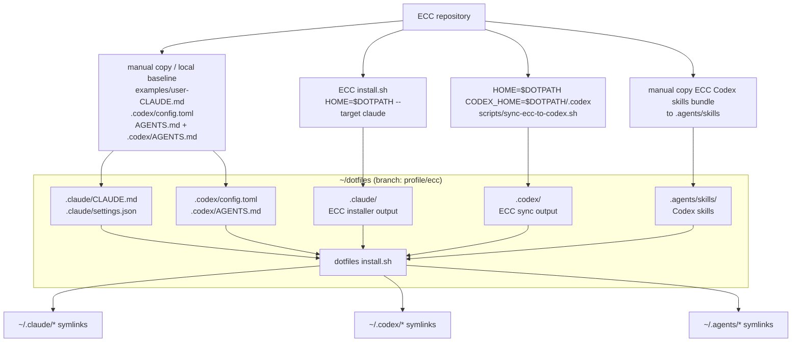

# ECC Dotfiles Manual Install Procedure

Last reviewed: 2026-05-28

この手順は、dotfiles 側の `.claude` / `.codex` がまっさらな状態から、Everything Claude Code (ECC) の manual install 対象を `HOME=$DOTPATH` で dotfiles に取り込み、実 HOME へは dotfiles の `install.sh` で symlink するためのものです。

## 前提

- dotfiles branch は `profile/ecc` を使う。
- ECC repo の場所は `ECC_REPO` 変数で指定する。
- Claude plugin route と Claude manual installer route は重ねない。今回は plugin ではなく、`HOME=$DOTPATH` で manual installer を利用する。
- Claude manual installer の既定 profile は `full` とする。
- Codex plugin route と Codex sync script route は重ねない。今回は plugin ではなく、`CODEX_HOME` 指定で sync script を利用する。
- 最初は必ず dry-run で配置先を確認する。

この手順のコマンド例では、最初に次の変数を定義して使います。`ECC_REPO` は自分の環境の clone 先に置き換えます。profile は `profile/ecc` branch の desired state として `full` をコマンドに直接指定します。

```bash
export DOTPATH="$HOME/dotfiles"
export ECC_REPO="/path/to/everything-claude-code"
```

## 全体像



`~/dotfiles (branch: profile/ecc)` は生成元ではなく、ECC からの installer / sync output と、installer 外で手動管理する user-level file を受ける profile 境界です。たとえば `CLAUDE.md` は後者にあたり、ECC installer では作られないため、必要なら `examples/user-CLAUDE.md` を元に dotfiles 側で管理します。

## Manual install の範囲

ECC の Claude manual installer は、profile に含まれる modules を `~/.claude/` に配置します。この手順では `HOME=$DOTPATH` を指定するため、実際の出力先は `~/dotfiles/.claude/` になります。

代表的な module と配置先は次です。

| module | 主な source | `HOME=$DOTPATH` での配置先 |
|---|---|---|
| `rules-core` | `rules/` | `~/dotfiles/.claude/rules/ecc/` |
| `agents-core` | `.agents/`, `agents/`, `AGENTS.md` | `~/dotfiles/.claude/.agents/`, `~/dotfiles/.claude/agents/`, `~/dotfiles/.claude/AGENTS.md` |
| `commands-core` | `commands/` | `~/dotfiles/.claude/commands/` |
| `hooks-runtime` | `hooks/`, `scripts/hooks/`, `scripts/lib/` | `~/dotfiles/.claude/hooks/`, `~/dotfiles/.claude/scripts/` |
| `platform-configs` | `.claude-plugin/`, `mcp-configs/`, setup scripts | `~/dotfiles/.claude/plugin.json`, `~/dotfiles/.claude/mcp-configs/`, `~/dotfiles/.claude/scripts/` |
| `workflow-quality` | workflow skills | `~/dotfiles/.claude/skills/ecc/` |
| `framework-language` | language/framework skills | `~/dotfiles/.claude/skills/ecc/` |
| `database` | database skills | `~/dotfiles/.claude/skills/ecc/` |
| `orchestration` | orchestration commands/scripts/skills | `~/dotfiles/.claude/commands/`, `~/dotfiles/.claude/scripts/`, `~/dotfiles/.claude/skills/ecc/` |

ECC installer の install-state は `~/dotfiles/.claude/ecc/install-state.json` に作られます。これは環境依存の実行結果なので、原則 commit しません。

### Profile choices

この手順で確認した profile は次です。operation数はこの環境で dry-run した目安です。

| profile | operations | 用途 |
|---|---:|---|
| `minimal` | 359 | rules / agents / commands / platform / workflow。hooksなしで軽めに試す。 |
| `core` | 474 | `minimal` + hooks runtime。ECCの基本挙動を一通り見る。 |
| `developer` | 577 | 通常開発向けの軽め候補。`core` + language/framework + database + orchestration。 |
| `security` | 490 | security-heavy profile。 |
| `research` | 499 | research / content / social workflows。 |
| `full` | 733 | 全classified modules。この branch の既定。 |

この dotfiles 方針では、`profile/ecc` branch を ECC の厚めの user-level agent profile として扱うため、`full` を既定にします。`developer` は、daily development の surface を軽くしたい別 branch / 別方針を作る場合の候補として扱います。

### Installer 外で手動管理するもの

次は ECC manual installer の主要対象ではなく、dotfiles profile として別途管理する優先度が高いものです。

- `.claude/CLAUDE.md`: Claude Code の user memory。ECC examples を参考にしつつ、最終的には自分の運用として管理する。
- `.claude/settings.json`: permissions, model, env, statusLine などの user settings。ECC hooks は manual installer が `.claude/hooks/hooks.json` に生成するため、ここには手動追加せず、既存の個人設定を維持しつつ調整する。
- `.codex/config.toml`: Codex の user config。ECC sync の入力として存在が必要。sync 後は ECC baseline / MCP settings が add-only で追記されるが、`AGENTS.md` のような marker block は入らない。
- `.codex/AGENTS.md`: Codex の global instructions。ECC sync により marker付き block が入る。
- `.agents/skills/`: Codex が読む user-level skills。ECC sync script は skills をコピーしないため、必要な skill はここへ手動で取り込む。
- `install.sh`: dotfiles から実 HOME へ symlink する責務を持つ。
- `docs/`: 今回の運用方針、`HOME=$DOTPATH` 手順、runtime state / branch 切り替え方針を記録する。

project-level の `AGENTS.md`, `CLAUDE.md`, `.codex/config.toml`, `.claude/settings.json` は別レイヤーとして後から各projectで管理します。

ECC repo からそのまま持ってこられるものは、次のコマンドで dotfiles 側に配置できます。既存ファイルを置き換えるため、実行前に `git diff` で差分を確認します。

```bash
cd "$DOTPATH"
mkdir -p .claude .codex

# Claude user memory example. ECC installer は ~/.claude/CLAUDE.md を作らないため、必要なら example を元に管理する。
cp "$ECC_REPO/examples/user-CLAUDE.md" .claude/CLAUDE.md

# Codex user config baseline. ECC sync は config.toml が存在しないと止まるため、空ではなくECC baselineから始めたい場合に使う。
cp "$ECC_REPO/.codex/config.toml" .codex/config.toml

# Codex global instructionsをsyncなしで下書きしたい場合。
# sync scriptを使う場合は、このファイルは作らなくてもよい。syncがmarker付きで生成/更新する。
{
  printf '<!-- BEGIN ECC -->\n'
  cat "$ECC_REPO/AGENTS.md"
  printf '\n\n---\n\n# Codex Supplement (From ECC .codex/AGENTS.md)\n\n'
  cat "$ECC_REPO/.codex/AGENTS.md"
  printf '\n<!-- END ECC -->\n'
} > .codex/AGENTS.md
```

上の `.codex/AGENTS.md` 生成は、ECC sync script の `compose_ecc_block` と同じ考え方です。既存の personal instructions を残したい場合は、`<!-- BEGIN ECC -->` block の外側に追記します。

### Claude settings と ECC hooks の分担

`.claude/settings.json` は ECC manual installer が生成・更新する対象ではありません。manual installer で `hooks-runtime` を入れる場合、ECC hooks は `~/dotfiles/.claude/hooks/hooks.json` に resolved hook graph として書かれます。

raw repo の `hooks/hooks.json` は plugin/repo oriented なので、`settings.json` に貼らず、直接 `~/dotfiles/.claude/hooks/hooks.json` にコピーもしません。

Claude Code の user setting として、ECC repo からは `statusLine` が使用できます。使う場合には `examples/statusline.json` の `statusLine` object を `.claude/settings.json` に手動で merge します。

つまり、ECC hooks は installer が作る `.claude/hooks/hooks.json`、個人の permissions / model / env / statusLine は `.claude/settings.json`、という分担になります。

manual install 後は Claude Code の `/hooks` で ECC hooks が見えているか確認します。Claude 公式ドキュメントでは user/project hooks は settings files、plugin hooks は plugin の `hooks/hooks.json` と説明されているため、この手順では ECC installer が生成した hook graph が実際に runtime から認識されることを確認してから常用します。

## 1. dotfiles branch を確認する

```bash
cd ~/dotfiles
git branch --show-current
```

`profile/ecc` でない場合は、先に branch を切り替えます。

```bash
git switch profile/ecc
```

新規に作る場合だけ、次を使います。

```bash
git switch -c profile/ecc
```

## 2. dotfiles 側の空ディレクトリを用意する

まっさらな状態から始める場合、dotfiles 側には最低限この3つを用意します。

```bash
cd ~/dotfiles
mkdir -p .claude .codex .agents/skills
```

Codex sync は `$CODEX_HOME/config.toml` が存在しないと止まるため、ECC baseline をコピーしない場合は空の config を先に作ります。

```bash
touch .codex/config.toml
```

`AGENTS.md` は存在しなくても構いません。存在しない場合、ECC sync が `~/dotfiles/.codex/AGENTS.md` を作ります。

## 3. ECC repo の依存関係を通常 HOME で入れる

ECC の installer / sync script は Node dependencies を使います。`HOME=$DOTPATH` で `npm install` が走ると npm cache 等が dotfiles 側に混ざる可能性があるため、依存関係は通常 HOME のまま先に解決します。

```bash
cd "$ECC_REPO"
npm install
```

## 4. Claude installer を HOME=$DOTPATH 指定で dry-run する

Claude 側は、`HOME=~/dotfiles` として ECC manual installer を実行します。これにより、ECC は `~/.claude` ではなく `~/dotfiles/.claude` を install root として扱います。

```bash
cd "$ECC_REPO"

HOME="$DOTPATH" bash ./install.sh --target claude --profile full --dry-run
```

dry-run で確認する主な出力先は次です。

```text
~/dotfiles/.claude/rules/ecc/
~/dotfiles/.claude/skills/ecc/
~/dotfiles/.claude/commands/
~/dotfiles/.claude/agents/
~/dotfiles/.claude/hooks/
~/dotfiles/.claude/scripts/
~/dotfiles/.claude/mcp-configs/
~/dotfiles/.claude/the-security-guide.md
~/dotfiles/.claude/ecc/install-state.json
```

## 5. Claude installer を実行して dotfiles 側へ適用する

dry-run の内容に問題がなければ、同じ `HOME=$DOTPATH` で apply します。

```bash
cd "$ECC_REPO"

HOME="$DOTPATH" bash ./install.sh --target claude --profile full
```

この時点では、実 HOME の `~/.claude` は直接変更されません。ECC の実体は `~/dotfiles/.claude` に入ります。

## 6. Codex sync を dotfiles 側の CODEX_HOME 指定で dry-run する

Codex sync script は、Claude installer と違って主な出力先を `HOME` ではなく `CODEX_HOME` から決めます。dotfiles 側へ受けるには `CODEX_HOME="$DOTPATH/.codex"` を明示します。

また、sync script の中で global git hooks 設定も扱われます。dry-run では書き込みませんが、apply 時は `git config --global core.hooksPath` に影響します。この手順では `GIT_CONFIG_GLOBAL="$DOTPATH/.gitconfig.local"` を明示し、tracked な `.gitconfig` ではなく machine-local な `.gitconfig.local` に逃がします。

ECC sync の dry-run 表示では `[dry-run] git config --global core.hooksPath ...` のように見えますが、`GIT_CONFIG_GLOBAL` を指定している場合、apply 時の実際の書き込み先は `$DOTPATH/.gitconfig.local` です。dry-run はこの設定変更を表示するだけで、ファイルは更新しません。

```bash
cd "$ECC_REPO"

HOME="$DOTPATH" \
CODEX_HOME="$DOTPATH/.codex" \
AGENTS_HOME="$DOTPATH/.agents" \
ECC_GLOBAL_HOOKS_DIR="$DOTPATH/.codex/git-hooks" \
GIT_CONFIG_GLOBAL="$DOTPATH/.gitconfig.local" \
bash scripts/sync-ecc-to-codex.sh --dry-run
```

dry-run で確認する主な出力先は次です。

```text
~/dotfiles/.codex/AGENTS.md
~/dotfiles/.codex/config.toml
~/dotfiles/.codex/agents/explorer.toml
~/dotfiles/.codex/agents/docs-researcher.toml
~/dotfiles/.codex/agents/reviewer.toml
~/dotfiles/.codex/prompts/ecc-*.md
~/dotfiles/.codex/prompts/ecc-prompts-manifest.txt
~/dotfiles/.codex/prompts/ecc-extension-prompts-manifest.txt
~/dotfiles/.codex/git-hooks/
~/dotfiles/.codex/backups/
```

Codex sync は `agents/` や `prompts/` の下に `ecc/` directory を切りません。`prompts` は `ecc-*` prefix、`agents` は sample role file 名で配置されます。

## 7. Codex sync apply を実行して dotfiles 側へ適用する

Codex sync apply は、AGENTS / config / agents / prompts / MCP に加えて、global git hooks 用の hook body 生成も行います。この手順では `GIT_CONFIG_GLOBAL="$DOTPATH/.gitconfig.local"` を明示し、`core.hooksPath` を tracked `.gitconfig` へ書かせません。

そのため、sync apply は `$DOTPATH/.codex/git-hooks/` と `$DOTPATH/.gitconfig.local` を生成・更新しますが、どちらも machine-local state として commit しません。この profile では、hook body を dotfiles 側に生成して観察しつつ、tracked `.gitconfig` や実 HOME の Git config には接続しない、という扱いにします。別環境でこの profile を使う場合は、dotfiles を pull したあとに Codex sync apply または ECC の git hook installer を再実行し、その環境の hook body と `core.hooksPath` を再生成します。

apply する場合は、dry-run の出力と `.gitconfig.local` への影響を確認してから実行します。

```bash
cd "$ECC_REPO"

HOME="$DOTPATH" \
CODEX_HOME="$DOTPATH/.codex" \
AGENTS_HOME="$DOTPATH/.agents" \
ECC_GLOBAL_HOOKS_DIR="$DOTPATH/.codex/git-hooks" \
GIT_CONFIG_GLOBAL="$DOTPATH/.gitconfig.local" \
bash scripts/sync-ecc-to-codex.sh
```

global hooks の生成自体も避けたい場合は、この sync apply は保留し、dry-run の結果を見ながら `AGENTS.md`, `config.toml`, `agents`, `prompts` を個別に取り込む方針にします。

### ECC global git hooks を実 HOME で有効化する

前段の Codex sync apply は dotfiles 側の `$DOTPATH` を出力先にするため、`core.hooksPath` も `$DOTPATH/.gitconfig.local` に逃がしています。このファイルは commit せず、`install.sh` でも実 HOME へ symlink しません。つまり、sync apply だけでは実 HOME の Git global hooks は有効になりません。

ECC の global git hooks をこの環境で実際に使う場合は、hook body を ignored path の `$DOTPATH/.codex/git-hooks/` に生成し、実 HOME の machine-local config である `$HOME/.gitconfig.local` に `core.hooksPath` を書きます。

```bash
cd "$ECC_REPO"

ECC_GLOBAL_HOOKS_DIR="$DOTPATH/.codex/git-hooks" \
GIT_CONFIG_GLOBAL="$HOME/.gitconfig.local" \
bash scripts/codex/install-global-git-hooks.sh --dry-run

ECC_GLOBAL_HOOKS_DIR="$DOTPATH/.codex/git-hooks" \
GIT_CONFIG_GLOBAL="$HOME/.gitconfig.local" \
bash scripts/codex/install-global-git-hooks.sh
```

有効化後は、実 HOME 側の Git config から hooksPath が見えることを確認します。

```bash
git config --global --get core.hooksPath
```

無効化する場合は、同じ machine-local config から `core.hooksPath` を外します。

```bash
GIT_CONFIG_GLOBAL="$HOME/.gitconfig.local" \
git config --global --unset core.hooksPath
```

## 8. Codex skills bundle を .agents/skills に取り込む

ECC の Codex sync script は skills を `~/.codex/skills/` や `~/.agents/skills/` へコピーしません。Codex は user-level skills を `$HOME/.agents/skills/` から読むため、この dotfiles では ECC repo の Codex skills bundle 全体を `~/dotfiles/.agents/skills/` に手動で取り込み、`install.sh` で `~/.agents/skills` へ symlink します。

つまり、Codex sync script は `AGENTS.md`, `config.toml`, `agents`, `prompts`, git hooks を扱い、Codex skills の実体化は別手順です。`install.sh` も ECC repo からの copy は行わず、dotfiles に置かれた desired state を実 HOME へ symlink するだけにします。

既存の `~/.agents/skills` が dotfiles 管理 symlink ではない directory として存在する場合、後段の `bash install.sh` は preflight で止まります。初回移行では、既存内容を `~/dotfiles/.agents/skills` へ統合するか、退避してから進めます。

取り込み対象は、ECC repo の `.agents/skills/` 全体です。ECC の `scripts/codex/check-codex-global-state.sh` はこの bundle のうち代表的な 16 skills を post-sync sanity check で確認しますが、skills の profile / subset 選択ではありません。

既存の bundle を置き換えるため、実行前後に `git diff -- .agents/skills` で差分を確認します。

```bash
cd "$DOTPATH"
rm -rf .agents/skills
mkdir -p .agents/skills
cp -R "$ECC_REPO/.agents/skills/." .agents/skills/
```

## 9. dotfiles の install.sh で実 HOME へ symlink する

ECC の実体を dotfiles 側に受けたあと、実 HOME へは dotfiles の `install.sh` で反映します。

```bash
cd ~/dotfiles
bash install.sh
```

`install.sh` は `.claude`, `.codex`, `.agents` を directory 丸ごとではなく、top-level entry ごとに symlink します。dot entry も対象にするため、`.claude/.agents` のような hidden entry も実 HOME へ反映できます。

一方で、`~/.claude/projects`, `~/.codex/auth.json`, sessions, logs, backups, git hooks, install-state などの runtime state は symlink しない skip list を持ちます。過去の実行で dotfiles 管理の symlink として貼られていた skipped entry や、branch 切り替えで target がなくなった stale symlink は削除します。

既存の `~/.claude/agents`, `~/.codex/prompts`, `~/.agents/skills` などが dotfiles 管理 symlink ではない file / directory として存在する場合、`install.sh` は symlink 作成前の preflight で error にします。既存内容を dotfiles 側へ移すか、退避してから再実行します。

## 10. commit / ignore 方針

`profile/ecc` branch は、ECC を使うときの user-level agent profile を表す再現可能な desired state として扱います。instruction / config / agent asset のうち、この profile の構成として再現・差分確認したいものは commit し、環境ごとに再生成される runtime state や credential は commit しません。

commit 対象の考え方:

- ECC installer / sync から取り込んだ asset のうち、`profile/ecc` の runtime surface として再現・差分確認したいものを commit する。
- Claude 側は `.claude/ecc/install-state.json` を除き、manual installer が配置した instruction / config / agent asset を対象にする。`--profile full` で増える `the-security-guide.md` のような top-level asset も、この定義に含める。
- Codex 側は sync script が配置した `AGENTS.md`, `config.toml`, `agents`, `prompts` などのうち、Codex runtime から読む desired state を対象にする。
- Codex skills は `.agents/skills/` のうち、Codex runtime から読む desired state を対象にする。
- `.claude/CLAUDE.md`, `.claude/settings.json`, `.codex/config.toml` など、installer 外で手動管理する user-level file も、この profile の desired state として必要なら commit する。
- `install.sh` や `docs/` は ECC asset ではなく、この方針を説明・実現する dotfiles local policy として別途 commit する。

ignore 対象:

- `.claude/ecc/install-state.json`
- `.codex/ecc-install-state.json` if using ECC codex-home installer
- `.codex/backups/`
- `.codex/git-hooks/` if regenerated by sync
- `.gitconfig.local`
- `.codex/auth.json`
- `.codex/sessions/`
- `.codex/logs/`
- `.claude/projects/`
- `.claude/session*`
- `.agents/logs/`, `.agents/cache/`, `.agents/tmp/`
- credentials, tokens, history databases, caches

ignore 対象は `.gitignore` でも enforce します。ignore 対象のファイルは branch を切り替えても作業ツリーに残ります。commit 対象は、`profile/ecc` の desired state として再現・差分確認したいものに限定します。ignore 対象は環境ごとの runtime state に限定します。

## 11. Uninstall / Regenerate 手順

この dotfiles では、uninstall / cleanup の対象を layer ごとに分けます。実 HOME 側は symlink layer、`~/dotfiles` 側は tracked desired state、ECC repo 側の lifecycle command は `HOME=$DOTPATH` で作った installer output を扱います。

この節のコマンド例だけを参照する場合は、先に次の変数を定義します。`ECC_REPO` は自分の環境の clone 先に置き換えます。

```bash
export DOTPATH="$HOME/dotfiles"
export ECC_REPO="/path/to/everything-claude-code"
```

### 実 HOME の symlink を update / cleanup する

`profile/ecc` に commit した ECC asset は、dotfiles branch の checkout に合わせて切り替わります。branch を切り替えた後は dotfiles の `install.sh` を実行し、実 HOME 側の symlink を新しい branch の desired state に合わせます。

```bash
cd "$DOTPATH"
git switch <target-branch>
bash install.sh
```

`install.sh` は、target がなくなった dotfiles 管理 symlink を stale symlink として削除します。これは `~/.claude`, `~/.codex`, `~/.agents` の中身にも適用されます。一方で、実 HOME にある non-managed file / directory や runtime state は削除しません。

### Claude installer output を uninstall / regenerate する

Claude manual installer で `~/dotfiles/.claude` に入れた generated asset を uninstall する場合は、ECC repo 側の uninstall を `HOME=$DOTPATH` 付きで実行します。実 HOME の `~/.claude` に対して ECC uninstall を実行する手順ではありません。

```bash
cd "$ECC_REPO"

HOME="$DOTPATH" node scripts/uninstall.js --target claude --dry-run
HOME="$DOTPATH" node scripts/uninstall.js --target claude
```

uninstall は `.claude/ecc/install-state.json` を基準に削除対象を判断します。この install-state は `.gitignore` 対象であり、`profile/ecc` の desired state として commit しません。clean clone や `git clean -X` 後は tracked asset は残っていても lifecycle state がないため、ECC の uninstall / doctor / repair / list は no-op になり得ます。その場合は、必要に応じて `HOME=$DOTPATH` で install を再実行し、state を再生成してから lifecycle command を使います。

同じ `profile/ecc` branch 内で ECC installer profile を作り直す場合は、uninstall 後に目的の profile で再 install します。この branch では `full` を標準にします。

```bash
HOME="$DOTPATH" bash ./install.sh --target claude --profile full
```

Claude installer output を uninstall / regenerate した後、実 HOME へ反映するには dotfiles 側で `bash install.sh` を実行します。

### Codex sync output を cleanup / regenerate する

Codex sync には Claude installer の `uninstall.js` に相当する専用 unsync script はありません。`scripts/sync-ecc-to-codex.sh` は backup / marker / manifest を持ちますが、基本は add-only merge と生成物配置です。

cleanup の考え方は次です。

- `.codex/AGENTS.md` は `<!-- BEGIN ECC -->` / `<!-- END ECC -->` の marker block を削除するか、Git の履歴から戻す。
- `.codex/config.toml` は add-only merge なので、自動逆変換せず、ECC baseline / MCP sections を手動で削るか、Git の履歴から戻す。
- `.codex/agents/*.toml` と `.codex/prompts/ecc-*` は generated output として cleanup / regenerate する。
- `.codex/backups/` は local backup であり、uninstall contract ではない。

Codex sync は existing agent role file を上書きせず、古い `ecc-*.md` prompt を自動削除しません。upstream 更新を取り直す場合は、manifest と prefix を基準に古い生成物を削除してから再 sync します。

```bash
cd "$DOTPATH"

if [ -f .codex/prompts/ecc-prompts-manifest.txt ]; then
  while IFS= read -r file; do
    [ -n "$file" ] && rm -f ".codex/prompts/$file"
  done < .codex/prompts/ecc-prompts-manifest.txt
fi

if [ -f .codex/prompts/ecc-extension-prompts-manifest.txt ]; then
  while IFS= read -r file; do
    [ -n "$file" ] && rm -f ".codex/prompts/$file"
  done < .codex/prompts/ecc-extension-prompts-manifest.txt
fi

rm -f .codex/prompts/ecc-*.md
rm -f .codex/prompts/ecc-prompts-manifest.txt .codex/prompts/ecc-extension-prompts-manifest.txt
rm -f .codex/agents/explorer.toml .codex/agents/docs-researcher.toml .codex/agents/reviewer.toml
```

その後、必要なら Codex sync apply を再実行します。

```bash
cd "$ECC_REPO"

HOME="$DOTPATH" \
CODEX_HOME="$DOTPATH/.codex" \
AGENTS_HOME="$DOTPATH/.agents" \
ECC_GLOBAL_HOOKS_DIR="$DOTPATH/.codex/git-hooks" \
GIT_CONFIG_GLOBAL="$DOTPATH/.gitconfig.local" \
bash scripts/sync-ecc-to-codex.sh
```

### Codex skills bundle を replace / regenerate する

Codex skills は sync script の output ではなく、ECC repo の `.agents/skills/` bundle を dotfiles に手動コピーしたものです。更新する場合は bundle 全体を置き換えます。

```bash
cd "$DOTPATH"
rm -rf .agents/skills
mkdir -p .agents/skills
cp -R "$ECC_REPO/.agents/skills/." .agents/skills/
```

`profile/ecc` から Codex skills を外す場合は、`.agents/skills` を tracked desired state から削除して commit し、その後 `bash install.sh` を実行します。実 HOME の `~/.agents/skills` が dotfiles 管理 symlink であれば、stale symlink として削除されます。

### ECC global git hooks を disable / cleanup する

Codex sync apply で生成した `$DOTPATH/.codex/git-hooks/` と `$DOTPATH/.gitconfig.local` は machine-local state です。dotfiles 側の観察用 hooksPath を消す場合は、`GIT_CONFIG_GLOBAL` を `$DOTPATH/.gitconfig.local` に向けて unset します。

```bash
GIT_CONFIG_GLOBAL="$DOTPATH/.gitconfig.local" \
git config --global --unset core.hooksPath
```

実 HOME で global hooks を有効化していた場合は、実 HOME 側の machine-local config からも unset します。

```bash
GIT_CONFIG_GLOBAL="$HOME/.gitconfig.local" \
git config --global --unset core.hooksPath
```

hook body 自体は ignored output なので、不要になったら `$DOTPATH/.codex/git-hooks/` を削除します。再度使う場合は `scripts/codex/install-global-git-hooks.sh` または Codex sync apply で再生成します。

## 12. 運用上の注意点

### Codex sync の入力 config を用意する

`scripts/sync-ecc-to-codex.sh` は `$CODEX_HOME/config.toml` を要求します。まっさらな `.codex` では、先に空ファイルを作ります。

```bash
cd ~/dotfiles
mkdir -p .codex
touch .codex/config.toml
```

### ECC repo の Node dependencies を入れる

ECC repo root で `npm install` を実行します。

```bash
cd "$ECC_REPO"
npm install
```

### Plugin route と manual route を混ぜない

Claude plugin route を使う場合、ECC README では `--profile full` の manual installer を重ねない方針が示されています。この手順では plugin ではなく manual installer を使うため、Claude の `/plugin install ecc@ecc` は使いません。

### Codex prompts / agents の配置を確認する

ECC の Codex sync は `~/.codex/prompts/ecc-*` と `~/.codex/agents/*.toml` に配置します。`~/.codex/prompts/ecc/` や `~/.codex/agents/ecc/` にはなりません。cleanup は file name / manifest file を基準に行います。
